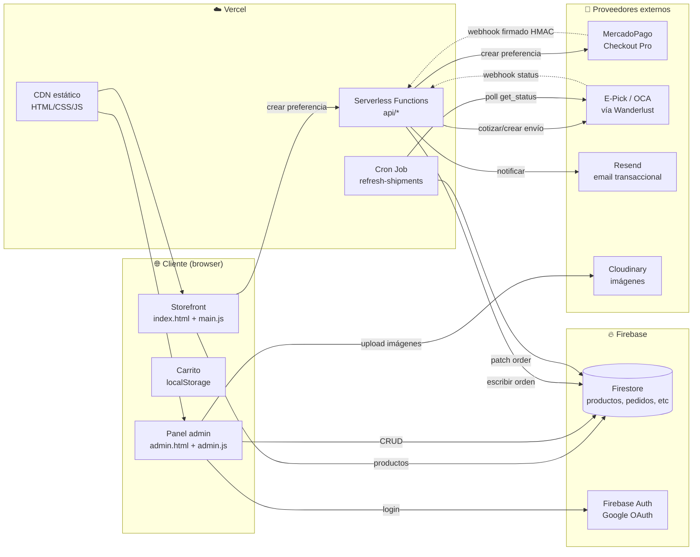

<div align="center">


# NYC Designs · E-commerce

**Tienda online de regalos personalizados con estilo NYC — full-stack, mobile-first, lista para producción.**

[](https://nycdesigns.com.ar)
[](#licencia)
[](#stack-tecnológico)
[](#stack-tecnológico)
[](#stack-tecnológico)
[](#stack-tecnológico)
[](#stack-tecnológico)
[](#stack-tecnológico)

**🛒 Live:** [nycdesigns.com.ar](https://nycdesigns.com.ar) · **🛠️ Admin Panel:** [/admin](https://nycdesigns.com.ar/admin/) (acceso restringido)

</div>

---

## Tabla de contenidos

- [Características](#características)
- [Capturas](#capturas)
- [Arquitectura](#arquitectura)
- [Modelo de datos](#modelo-de-datos)
- [Stack tecnológico](#stack-tecnológico)
- [Seguridad y privacidad](#seguridad-y-privacidad)
- [Variables de entorno](#variables-de-entorno)
- [Testing](#testing)
- [Estructura de carpetas](#estructura-de-carpetas)
- [Setup local](#setup-local)
- [Roadmap y deuda técnica](#roadmap-y-deuda-técnica)
- [Licencia](#licencia)

---

## Características

### 🛍️ Storefront

- **Catálogo dinámico** desde Firestore con búsqueda, filtros multinivel (categoría → tipo → variante) y paginación
- **Carrito persistente** con `localStorage` (clave `nycCart`)
- **MercadoPago Checkout Pro** — tarjeta, débito, transferencia, efectivo (Rapipago, Pago Fácil)
- **Cálculo de envío real** vía E-Pick API: cotización + verificación de cobertura por código postal
- **Validación pre-pago de cobertura** — si E-Pick no llega, deshabilita el botón
- **Sistema de variantes/subcategorías** — un mismo producto admite tipos (ej: Polaroids, Kodak) y variantes (ej: 14, 28, 42 unidades)
- **Imágenes optimizadas on-the-fly** vía Cloudinary (`f_auto, q_auto, w_600` → WebP/AVIF, ~70% menos KB)
- **Mobile-first** con touch targets ≥ 44×44 (HIG iOS), gradiente rosa adaptativo, anti-zoom iOS Safari
- **SEO completo** — title/meta description optimizados, Open Graph, Twitter Cards, JSON-LD `LocalBusiness + Store + WebSite`, sitemap.xml, robots.txt
- **Chatbot** con knowledge base local y quick-replies

### 🔐 Panel Admin (`/admin/`)

7 secciones con CRUD completo:

| Sección | Acciones |
|---|---|
| **Dashboard** | Métricas, alertas de stock bajo, pedidos pendientes |
| **Productos** | Wizard 6 pasos · hasta 5 imágenes · dimensiones de envío · sistema de variantes |
| **Pedidos** | Historial completo · cliente + DNI + dirección · crear/ver envío E-Pick · WhatsApp directo |
| **Testimonios** | Aprobación + visibilidad de reseñas |
| **Cupones** | Códigos % o monto fijo, expiración, máximo de usos |
| **Mensajes** | Bandeja del form de contacto |
| **Configuración** | Banner, horarios, tiempo de producción, cuotas, migración masiva de categorías |

Acceso por **Google OAuth** con allowlist server-side (Firestore Rules).

### 📦 Logística automatizada

- **Auto-creación de envío** al aprobarse el pago (E-Pick `get_etiquetas`, idempotente por `payment_id`)
- **Tracking en Firestore** actualizado en cada paso
- **Cron diario** (`/api/cron/refresh-shipments`) que consulta E-Pick `get_status` y notifica al cliente cuando cambia el estado (en preparación → en camino → entregado)
- **Webhook receiver** para updates en tiempo real cuando el proveedor lo registra

### 📧 Notificaciones transaccionales (Resend)

- Email a **Sol** (admin) con detalle completo cuando entra una orden
- Email al **cliente** con confirmación + tracking
- Email automático en cada cambio de estado del envío
- Fire-and-forget — un fallo de Resend nunca rompe el flujo de orden

---

## Capturas

<details open>
<summary><strong>Desktop</strong></summary>

| Home / Hero | Catálogo + filtros | Modal de producto |
|---|---|---|
|  |  |  |

| Carrito | Checkout completo | Admin · Pedidos |
|---|---|---|
|  |  |  |

</details>

<details>
<summary><strong>Mobile</strong></summary>

| Home | Catálogo + variantes | Carrito + checkout |
|---|---|---|
|  |  |  |

</details>

> 📂 Las capturas viven en `docs/screenshots/`. Para reemplazarlas, sustituí los `.png` manteniendo los nombres.

---

## Arquitectura



### Flujo de compra (paso a paso)

1. Cliente arma el carrito en el browser (localStorage).
2. Completa datos personales + dirección + elige modalidad.
3. Si elige envío → `POST /api/epick-cotizar` y `POST /api/epick-cobertura` en paralelo.
4. Click *Pagar* → `POST /api/create-preference`:
   - Validación de origin (allowlist)
   - Rate limit por IP (10 req/min)
   - **Validación server-side de precios contra Firestore** (anti-tampering)
   - Genera preferencia en MercadoPago
5. Browser redirige a checkout de MP.
6. Cliente paga → MP envía webhook firmado a `POST /api/webhook`:
   - Verifica firma HMAC + timestamp skew ≤ 5 min
   - Guarda orden en Firestore
   - Descuenta stock
   - Llama E-Pick `get_etiquetas` (idempotente por `payment_id`)
   - Dispara emails de confirmación
7. Cron diario monitorea estado de envío hasta entrega.

---

## Modelo de datos

### Colección `productos`

```json
{
  "id": "0VS7ZIAso4xGp7UccvIz",
  "nombre": "Stickers Escena 3D (Pocket Home)",
  "descripcion": "Mini escena en 3D con stickers troquelados",
  "precio": 6000,
  "precio_anterior": null,

  "categoria": "stickers-escena-3d",
  "productType": "Escena 3D",
  "variante": "Pocket Home",

  "stock": 12,
  "imagen": "https://res.cloudinary.com/dgbdzcgkg/.../pocket-home.jpg",
  "imagenes": [
    "https://res.cloudinary.com/.../front.jpg",
    "https://res.cloudinary.com/.../back.jpg"
  ],

  "peso": 0.15,
  "largo": 10,
  "ancho": 8,
  "alto": 4,

  "destacado": true,
  "visible": true,
  "badges": ["Nuevo"],
  "orden": 1,
  "createdAt": "2026-03-10T14:22:00Z",
  "updatedAt": "2026-05-21T18:00:00Z"
}
```

### Colección `pedidos`

```json
{
  "id": "order_115720234567",
  "payment_id": "115720234567",
  "status": "approved",
  "total": 19940,

  "customer": {
    "name": "Juan Pérez",
    "dni": "38123456",
    "email": "juan@example.com",
    "phone": "541123456789"
  },

  "items": [
    {
      "product_id": "0VS7ZIAso4xGp7UccvIz",
      "title": "Stickers Escena 3D (Pocket Home)",
      "quantity": 1,
      "unit_price": 6000
    }
  ],

  "shipping_type": "delivery",
  "shipping_label": "Envío a domicilio (E-Pick)",
  "shipping_address": {
    "street": "Av. Corrientes",
    "number": "1234",
    "extra": "Depto 3B",
    "city": "CABA",
    "province": "C",
    "notes": "Tocar timbre 2"
  },
  "postal_code": "1043",

  "tracking_code": "EP-2026-LK934X",
  "label_url": "https://...",
  "shipping_status": "in_transit",
  "shipping_updated_at": "2026-05-22T15:00:00Z",

  "createdAt": "2026-05-21T20:00:00Z"
}
```

### Documento `configuracion/general`

```json
{
  "bannerText": "",
  "shipping": {
    "productionTime": "3-7 días hábiles",
    "methods": "Retiro / E-Pick"
  },
  "hours": {
    "weekday": "10:00 - 19:00",
    "saturday": "10:00 - 14:00",
    "sunday": "cerrado"
  },
  "installments": {
    "enabled": false,
    "count": 3
  }
}
```

---

## Stack tecnológico

| Capa | Tecnología | Por qué |
|---|---|---|
| **Frontend** | HTML5 + CSS3 + JavaScript ES2020 (vanilla) | Zero build · deploy directo · mantenible sin dev fulltime |
| **Auth** | Firebase Auth 10.7.0 (compat SDK) + Google OAuth | Sin contraseñas que gestionar |
| **Base de datos** | Firebase Firestore | NoSQL · queries en tiempo real · rules como capa de seguridad |
| **Storage** | Cloudinary (unsigned preset con folder/format restrictions) | CDN incluido · transformaciones on-the-fly |
| **Hosting** | Vercel (Hobby plan) | Deploy automático desde GitHub · serverless functions |
| **Backend** | Vercel Serverless Functions (Node.js 20) | Sin servidores que mantener · escala automático |
| **Pagos** | MercadoPago Checkout Pro (preferencias + webhook HMAC) | Estándar argentino |
| **Envíos** | E-Pick API vía Wanderlust Codes (OCA detrás) | Cobertura nacional |
| **Email** | Resend (free tier 100/día) | Sin SMTP · simple HTTP API |
| **Tipografía** | Inter (Google Fonts) | Limpia, gratuita, profesional |

---

## Seguridad y privacidad

### 🔐 Manejo de secretos

| Secreto | Dónde vive | Notas |
|---|---|---|
| `MP_ACCESS_TOKEN` | Vercel Env Vars (Production) | Backend only — nunca en cliente |
| `MP_WEBHOOK_SECRET` | Vercel Env Vars (Production) | Firma HMAC verificada en cada webhook |
| `RESEND_API_KEY` | Vercel Env Vars (Production) | Backend only |
| `EPICK_API_KEY` | Vercel Env Vars (Production) | Backend only |
| `EPICK_WEBHOOK_TOKEN` | Vercel Env Vars (Production) | Shared token con Wanderlust |
| `CRON_SECRET` | Vercel Env Vars (Production) | Protege endpoints de cron |
| `FIREBASE_API_KEY` (backend) | Vercel Env Vars (Production) | Para llamadas server-side al REST API |

### 🔑 Claves "públicas" por diseño (presentes en código)

- **Firebase Web `apiKey`** en `main.js` / `admin.js` — [no es un secreto](https://firebase.google.com/docs/projects/api-keys); identifica el proyecto. La seguridad real está en las Firestore Rules.
- **Cloudinary `cloudName`** — aparece en cada URL del CDN. Es público por definición.

### 🛡️ Capas de defensa

| Vector | Mitigación |
|---|---|
| **Manipulación de precios** | Backend ignora `unit_price` del cliente y consulta Firestore (`getProductPrice(item.id)` en `api/create-preference.js`) |
| **Webhook forgery** | HMAC validation con `crypto.timingSafeEqual` + replay protection (5 min skew) |
| **XSS** | `escapeHtml()` en todo `innerHTML` con data de usuario |
| **CSRF / origin spoofing** | Allowlist explícita en cada endpoint |
| **CSP estricta** | `vercel.json` — `script-src` whitelist (Firebase, MP, Cloudinary, GA), `frame-ancestors 'none'` |
| **Clickjacking** | `X-Frame-Options: DENY` + `frame-ancestors 'none'` |
| **Downgrade attacks** | `Strict-Transport-Security` con preload (2 años) |
| **HTTP fuerza HTTPS** | Redirect 308 automático |
| **Spam de form** | Honeypot field + Firestore Rules de write-only sobre `mensajes` |
| **Rate limit** | 10 req/min/IP en `/api/create-preference`, 30 req/min en `/api/epick-cotizar` |
| **Firestore Rules** | Reads públicos solo para productos/testimonios/cupones/configuración; pedidos y mensajes admin-only; writes restringidos a `isAdmin()` |
| **Cron protegido** | Token obligatorio (`CRON_SECRET`) por header o query |

### 🔒 Firestore Security Rules (resumen)

```javascript
match /productos/{id}        { allow read: if true;  allow write: if isAdmin(); }
match /testimonios/{id}      { allow read: if true;  allow write: if isAdmin(); }
match /cupones/{id}          { allow read: if true;  allow write: if isAdmin(); }
match /configuracion/{id}    { allow read: if true;  allow write: if isAdmin(); }
match /mensajes/{id}         { allow create: if true; allow read, update, delete: if isAdmin(); }
match /pedidos/{id}          { allow read, write: if isAdmin(); }

function isAdmin() {
  return request.auth != null
      && request.auth.token.email in [/* allowlist */];
}
```

### 🕵️ Privacidad

- Datos personales del cliente (nombre, DNI, email, teléfono, dirección) viajan **solo** a:
  - Firestore (cifrado at-rest por Google)
  - MercadoPago (procesamiento de pago)
  - E-Pick (logística, solo lo necesario para envío)
  - Resend (solo email + nombre para la plantilla)
- **Cero analytics de terceros sin consentimiento** activos hoy.
- **Sin cookies de tracking** salvo `localStorage` propio para el carrito.

---

## Variables de entorno

Ver [`ENV_TEMPLATE.md`](./ENV_TEMPLATE.md) para la lista completa con ejemplos.

### Producción mínima

```env
# MercadoPago
MP_ACCESS_TOKEN=APP_USR-...
MP_WEBHOOK_SECRET=<hex64>

# Firebase
FIREBASE_API_KEY=AIza...

# E-Pick / Wanderlust Codes
EPICK_LIVE=1
EPICK_API_KEY=<provided>
EPICK_ORIGIN_ZIP=1408
EPICK_WEBHOOK_TOKEN=<hex64>

# Resend
RESEND_API_KEY=re_...
ORDER_NOTIFY_TO=newyorkcitydesigns4@gmail.com

# Cron
CRON_SECRET=<hex64>
```

> ⚠️ Nunca commitees valores reales. El repo solo trae `ENV_TEMPLATE.md` con la documentación de cada variable.

---

## Testing

### Compatibilidad verificada

| Categoría | Cubierto |
|---|---|
| **Browsers desktop** | Chrome 120+, Firefox 120+, Safari 17+, Edge 120+ |
| **Browsers mobile** | Chrome Android, Safari iOS 16+, Samsung Internet |
| **Resoluciones** | 320px (iPhone SE) → 1920px (desktop full HD) |
| **Touch** | iOS HIG 44×44px mínimo + anti-zoom inputs (font-size ≥ 16px) |

### Manejo de errores

- `try/catch` en todas las funciones async críticas (`processPayment`, `loadProducts`, todos los endpoints `api/*`)
- **Fallback localStorage** si Firestore no carga (modo readonly del catálogo)
- **Fallback de cotización** local si E-Pick API falla → tabla de precios por zona
- **Fallback de emails** silencioso si Resend no responde — la orden se guarda igual
- **Idempotencia** en webhook MP por `payment_id` + en `get_etiquetas` por external_reference
- **Anti-replay** en webhook por timestamp skew

### Sin testing automatizado (todavía)

Ver [`TECH_DEBT.md`](./TECH_DEBT.md) — Fase 2 sugiere Vitest para unit tests + Playwright para E2E del flujo de compra.

---

## Estructura de carpetas

```
.
├── admin/
│   ├── admin.css        # estilos del admin (3.6k líneas)
│   ├── admin.js         # CRUD + auth (2.3k líneas)
│   └── index.html       # markup del admin
├── api/
│   ├── _lib/
│   │   ├── notifyOrder.js     # plantillas + envío email vía Resend
│   │   └── rateLimit.js       # rate limit in-memory
│   ├── cron/
│   │   └── refresh-shipments.js   # cron diario E-Pick status
│   ├── create-preference.js   # crea preferencia MP (con validación server-side)
│   ├── webhook.js             # recibe webhook MP firmado
│   ├── epick-cotizar.js       # POST → cotización E-Pick
│   ├── epick-cobertura.js     # POST → verifica cobertura
│   ├── epick-crear-envio.js   # POST → genera etiqueta
│   ├── epick-tracking.js      # POST → estado actual
│   └── epick-webhook.js       # recibe push de Wanderlust
├── assets/
│   └── img/             # logo y assets propios
├── config/
│   └── shipping.js      # EPICK_CONFIG + helpers + callEpickProxy()
├── css/
│   └── styles.css       # estilos del storefront (3k líneas)
├── docs/
│   ├── screenshots/     # capturas para este README
│   ├── FIREBASE_SETUP.md
│   └── MANUAL_ADMIN.md
├── js/
│   └── main.js          # storefront completo (2.4k líneas)
├── videos/              # shorts del producto
├── 404.html
├── ENV_TEMPLATE.md      # variables de entorno documentadas
├── firestore.rules      # security rules (publicar en Firebase Console)
├── index.html           # storefront
├── manifest.json        # PWA
├── robots.txt
├── sitemap.xml
├── TECH_DEBT.md         # roadmap de refactor / Fase 2
└── vercel.json          # rewrites, redirects, headers, crons
```

---

## Setup local

```bash
# 1. Clonar
git clone https://github.com/ezequielpazz/nyc-designs.git
cd nyc-designs

# 2. Crear .env.local con las variables (ver ENV_TEMPLATE.md)
cp ENV_TEMPLATE.md .env.local   # luego editar valores

# 3. Correr con Vercel CLI
npm i -g vercel
vercel dev
# → http://localhost:3000

# 4. Publicar Firestore Rules en Firebase Console:
#    https://console.firebase.google.com/project/<tu-proyecto>/firestore/rules
#    Pegar contenido de firestore.rules → Publicar
```

> No hay paso de `build`. El front es estático puro, los endpoints son
> serverless functions que Vercel detecta automáticamente.

---

## Roadmap y deuda técnica

Ver [`TECH_DEBT.md`](./TECH_DEBT.md) para el plan completo de Fases 1-3.

**TL;DR:**

| Fase | Trigger | Foco |
|---|---|---|
| **0 — Lanzamiento** | Ahora | Validación demanda, contenidos, compra de prueba |
| **1 — Polish** | Primeras 10 ventas | Bot actualizado, dimensiones precisas, GA4 real |
| **2 — Mantenibilidad** | >100 pedidos/mes | ES modules nativos, tests con Vitest, sitemap por producto |
| **3 — Escala** | >500 pedidos/mes | Reactividad (Alpine.js/Preact), Upstash rate limit, Sentry |

---

## Licencia

MIT © 2026 — [LICENSE](./LICENSE)

```
MIT License

Permission is hereby granted, free of charge, to any person obtaining a copy
of this software and associated documentation files (the "Software"), to deal
in the Software without restriction, including without limitation the rights
to use, copy, modify, merge, publish, distribute, sublicense, and/or sell
copies of the Software, and to permit persons to whom the Software is
furnished to do so, subject to the following conditions:

The above copyright notice and this permission notice shall be included in
all copies or substantial portions of the Software.

THE SOFTWARE IS PROVIDED "AS IS", WITHOUT WARRANTY OF ANY KIND.
```

---

<div align="center">

**Hecho con ☕ por [@ezequielpazz](https://github.com/ezequielpazz)** · Tienda de [@newyorkcitydesigns](https://instagram.com/newyorkcitydesigns)

</div>
